<p align="center">
  
</p>

<h1 align="center">E-commerce Fashion ADN</h1>

<p align="center">
  
  
  
  
  
  
  
  
  
  
  
</p>

## Overview

E-commerce Fashion ADN is a cutting-edge frontend project powered by TypeScript and Redux Toolkit, designed to deliver a dynamic e-commerce experience. From fashion to electronics and more, this platform is tailored to meet the diverse shopping needs of users, providing a seamless and intuitive journey. Customers can easily create orders and explore products with advanced sorting options. Meanwhile, administrators enjoy full control over orders, users, products, and other crucial aspects of the e-commerce operations, ensuring efficient management. Experience the innovation firsthand by exploring our live demo at

[](https://ecommerce-fashion-adn.netlify.app/)

### Backend

The backend repository serves as the backbone of the e-commerce platform, handling server-side logic, database interactions, and API endpoints. It is built on ASP.NET Core and follows Clean Architecture principles, ensuring maintainability and scalability. The database used is PostgreSQL, providing robust data storage and retrieval capabilities. This setup enables efficient management of user sessions, product data, and orders. For more details, you can explore the backend repository [](https://github.com/adhanif/fs17_CSharp_FullStack)

# Table of Contents

<details>
  <summary><strong>E-commerce Fashion ADN</strong></summary>

- [Overview](#overview)
- [App Images](#app-images)
- [Technologies Used (Tech Stack)](#technologies-used-tech-stack)
- [Getting Started](#getting-started)
- [Usage](#usage)
- [Environment Variables](#environment-variables)
- [Testing](#testing)
- [Features](#features)
  - [Redux Store](#redux-store)
    - [Product Reducer](#product-reducer)
    - [User Reducer](#user-reducer)
    - [Cart Reducer](#cart-reducer)
- [Project Folder Structure](#project-folder-structure)
- [API Endpoint](#api-endpoint)
- [Scripts](#scripts)
- [Deployment](#deployment)
- [License](#license)
</details>

## APP Images

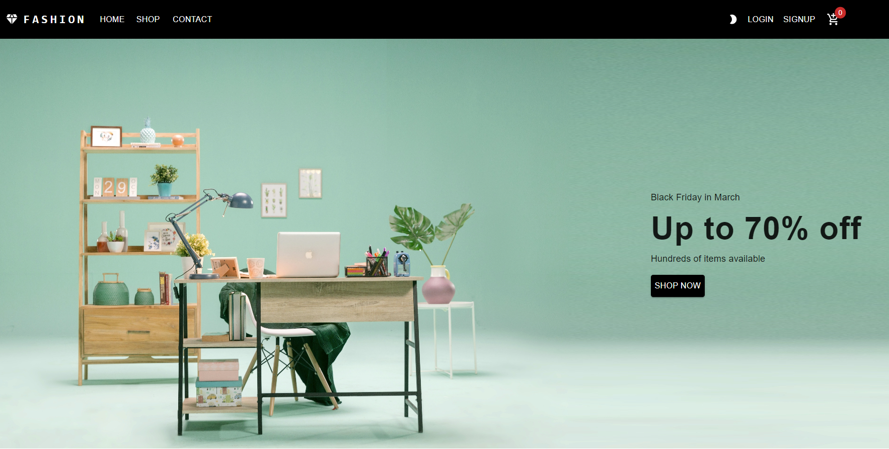
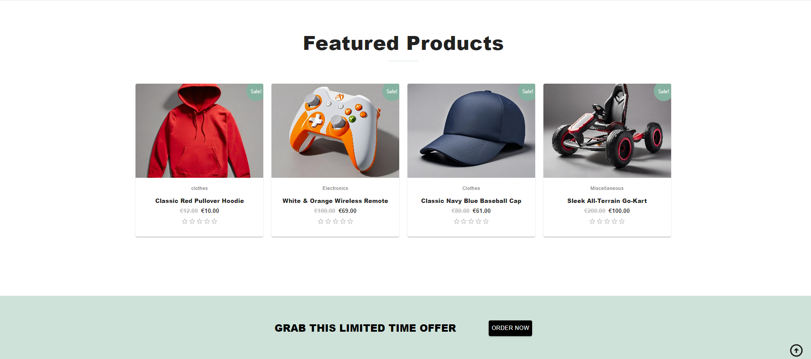
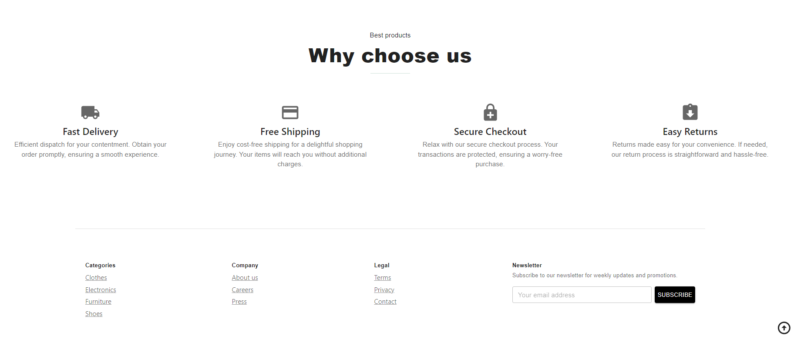
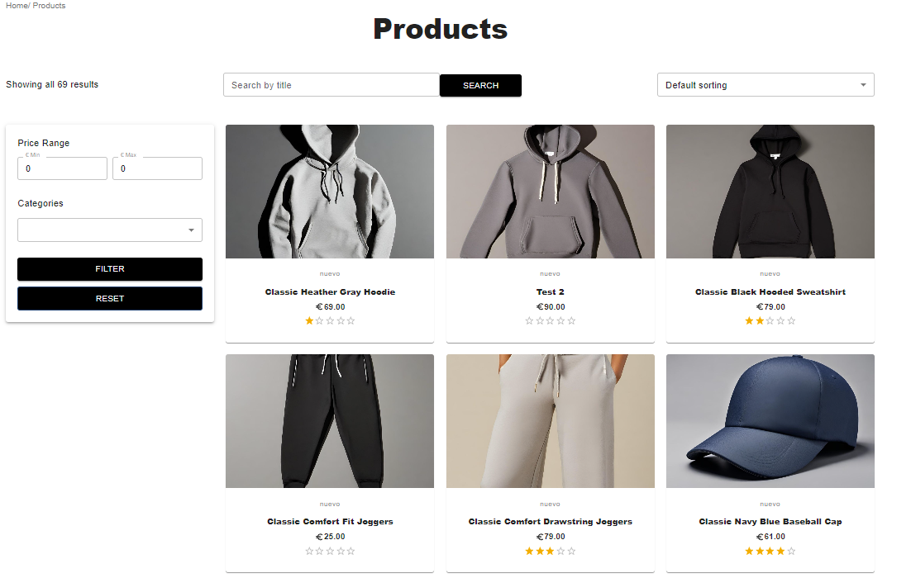

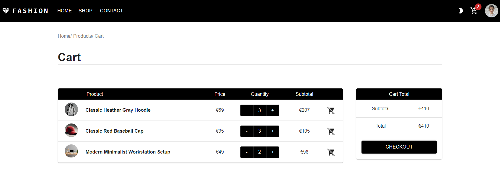
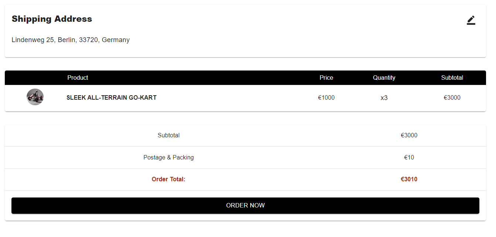
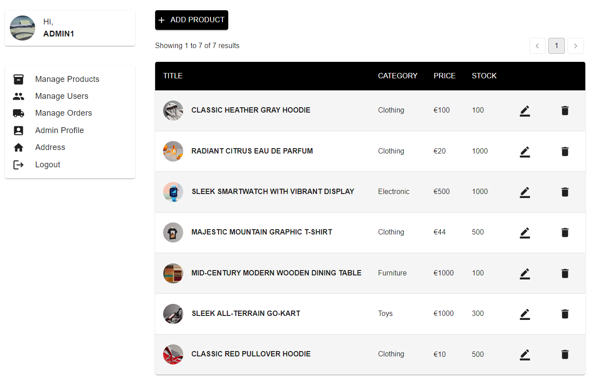
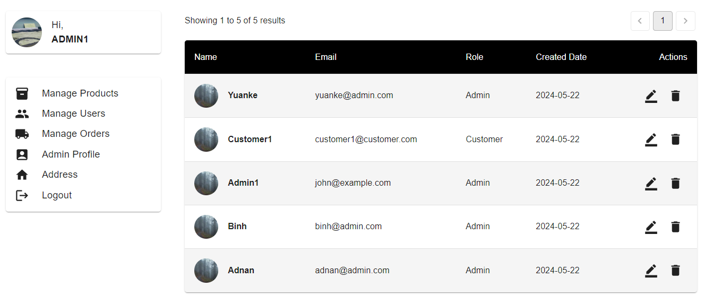
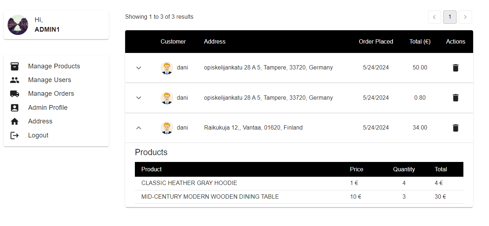

## Technologies Used (Tech Stack)

- **TypeScript**: Provides static typing for enhanced code quality.
- **Redux Toolkit**: Manages state efficiently.
- **RTK Query**: Simplifies data fetching and state management for APIs.
- **React**: The core library for building the user interface.
- **React Router**: Enables navigation between pages.
- **Styled Components**: Utilized for styling components.
- **Lodash**: Utility library for various functionalities.
- **@react-oauth/google**: Google login integration.
- **React Leaflet**: Integration for interactive maps.
- **Material-UI**: Provides a rich set of pre-designed React components for faster and easier development.
- **React Hook Form**: Form handling library for React applications.

## Getting started

1. Clone the repository.

   ```bash
   git clone https://github.com/adhanif/Ecommerce-ADN.git

   ```

2. Navigate to the project directory.

   ```bash
   cd Ecommerce-ADN

   ```

3. Install dependencies.
   ```bash
   npm install
   ```

# Usage

1. To start the App
   ```bash
   npm start
   ```
2. Use the following command to run tests:
   ```bash
   npm test
   ```
3. To use admin functionalities, please use this account:
   ```bash
   email: john@example.com
   password: admin@123
   ```

# Testing

The testing suite for this project is implemented with Jest and utilizes msw for server mocking. During testing, two mock servers were implemented for products and users using Jest in conjunction with msw. These servers are pivotal for evaluating different facets of the application's functionality, ensuring a comprehensive testing approach.

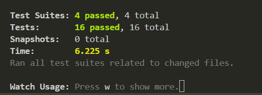

# Features

## Redux Store

### Product Reducer

- **Get all products:** Fetches all products from the API.
- **Find a single product:** Retrieves details for a specific product.
- **Filter by categories:** Allows users to filter products by categories.
- **Sort products by price:** Enables sorting of products based on price.
- **CRUD operations:** Admin can create, update, and delete products.

### User Reducer

- **Register and login:** Users can register for an account and log in.

### Cart Reducer

- **Add product to cart:** Adds products to the user's shopping cart.
- **Remove from cart:** Removes products from the cart.
- **Update product quantity in the cart.**

# Project Folder Structure

📁src  
├─ 📁 components  
│ ├─ 📁 adminProfile  
│ │ ├─ 📄 AdminInfoCard.tsx  
│ │ ├─ 📄 AdminOrdersTable.tsx  
│ │ ├─ 📄 AdminProductTable.tsx  
│ │ ├─ 📄 AdminProfileCard.tsx  
│ │ └─ 📄 AdminUsersTable.tsx  
│ ├─ 📁 cart  
│ │ └─ QuantityControlButton.tsx  
│ ├─ 📁 contact  
│ │ ├─ 📄 ContactForm.tsx  
│ │ └─ 📄 MapDetail.tsx  
│ ├─ 📁 contextAPI  
│ │ └─ 📄 ThemeContext.tsx  
│ ├─ 📁 customStyling  
│ │ ├─ 📄 buttons.ts  
│ │ └─ 📄 table.ts  
│ ├─ 📁 featuredProducts  
│ │ ├─ 📄 FeaturedProductCard.tsx  
│ │ └─ 📄 FeaturedProducts.tsx  
│ ├─ 📁 footer  
│ │ └─ 📄 Footer.tsx  
│ ├─ 📁 heroSection  
│ │ ├─ 📄 HeroSection.tsx  
│ │ └─ 📄 WhyChooseUs.tsx  
│ ├─ 📁 hooks  
│ │ └─ 📄 useDispatchApp.ts  
│ ├─ 📁 images  
│ │ ├─ 📄 american.png  
│ │ ├─ 📄 cap.jpeg  
│ │ ├─ 📄 car.jpg  
│ │ ├─ 📄 discover.png  
│ │ ├─ 📄 google.png  
│ │ ├─ 📄 hero1.jpg  
│ │ ├─ 📄 hero2.jpg  
│ │ ├─ 📄 hoddie.jpeg  
│ │ ├─ 📄 master.png  
│ │ ├─ 📄 remote.jpeg  
│ │ └─ 📄 visa.png  
│ ├─ 📁 loading  
│ │ └─ 📄 Loading.tsx  
│ ├─ 📁 navBar  
│ │ ├─ 📄 NavBar.tsx  
│ │ └─ 📄 ToggleColorMode.tsx  
│ ├─ 📁 notification  
│ │ └─ 📄 NotificationSnackBars.tsx  
│ ├─ 📁 order  
│ │ ├─ 📄 CheckOutOrder.tsx  
│ │ ├─ 📄 FetchAllOrdersUser.tsx  
│ │ └─ 📄 OrdersTable.tsx  
│ ├─ 📁 product  
│ │ ├─ 📄 FilterProducts.tsx  
│ │ ├─ 📄 ProductCard.tsx  
│ │ ├─ 📄 ProductCreateForm.tsx  
│ │ └─ 📄 ProductEditForm.tsx  
│ ├─ 📁 scroller  
│ │ └─ 📄 Scroller.tsx  
│ ├─ 📁 theme  
│ │ └─ 📄 ThemeContext.ts  
│ ├─ 📁 userProfile  
│ │ ├─ 📄 UserAddress.tsx  
│ │ ├─ 📄 UserAddressCard.tsx  
│ │ ├─ 📄 UserEditForm.tsx  
│ │ ├─ 📄 UserInfoCard.tsx  
│ │ └─ 📄 UserProfileCard.tsx  
│ └─ 📁 utils  
│ ├─ 📄 PrivateRoutes.tsx  
│ └─ 📄 products.ts  
├─ 📁 misc  
│ └─ 📄 types.ts  
├─ 📁 pages  
│ ├─ 📄 Admin.tsx  
│ ├─ 📄 Cart.tsx  
│ ├─ 📄 Contact.tsx  
│ ├─ 📄 GoogleUSerProfile.tsx  
│ ├─ 📄 Home.tsx  
│ ├─ 📄 LoginForm.tsx  
│ ├─ 📄 NoAuthorization.tsx  
│ ├─ 📄 ProductDetail.tsx  
│ ├─ 📄 ProductsDataFetch.tsx  
│ ├─ 📄 RegisterForm.tsx  
│ └─ 📄 UserProfile.tsx  
├─ 📁 redux  
│ ├─ 📁 slices  
│ │ ├─ 📄 addressSlice.ts  
│ │ ├─ 📄 cartSlice.ts  
│ │ ├─ 📄 notificationSlice.ts  
│ │ ├─ 📄 orderSlice.ts  
│ │ ├─ 📄 productSlice.ts  
│ │ └─ 📄 userSlice.ts  
│ ├─ 📄 addressQuery.ts  
│ ├─ 📄 orderQuery.ts  
│ ├─ 📄 productsQuery.ts  
│ ├─ 📄 store.ts  
│ └─ 📄 userQuery.ts  
├─ 📁 test  
│ ├─ 📁 cart  
│ │ └─ 📄 cartReducer.test.ts  
│ ├─ 📁 notification  
│ │ └─ 📄 notificationReducer.test.ts  
│ ├─ 📁 product  
│ │ └─ 📄 productQuery.test.ts  
│ └─ 📁 shared  
│ ├─ 📄 mockData.ts  
│ ├─ 📄 productServer.ts  
│ └─ 📄 userServer.ts  
├─ 📄 App.css  
├─ 📄 App.tsx  
├─ 📄 index.css  
├─ 📄 index.tsx  
├─ 📄 logo.svg  
├─ 📄 react-app-env.d.ts  
├─ 📄 reportWebVitals.ts  
└─ 📄 setupTests.ts

## API Endpoint

All the endpoints of the API are documented and can be tested directly on the generated Swagger page. From there, you can view each endpoint URL, their HTTP methods, request body structures, and authorization requirements.

**Access the Swagger page from this link:**

[](https://fashion-adn.azurewebsites.net/index.html)

Click the button above to explore and test the API endpoints using Swagger.

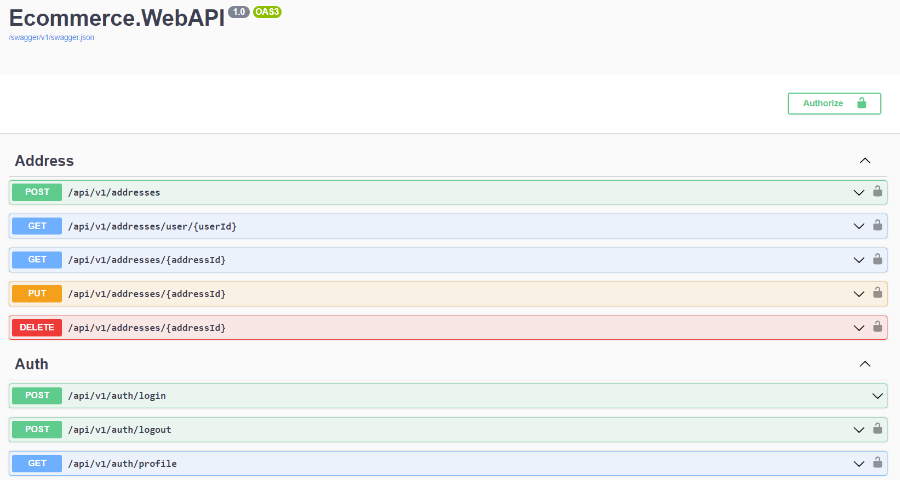
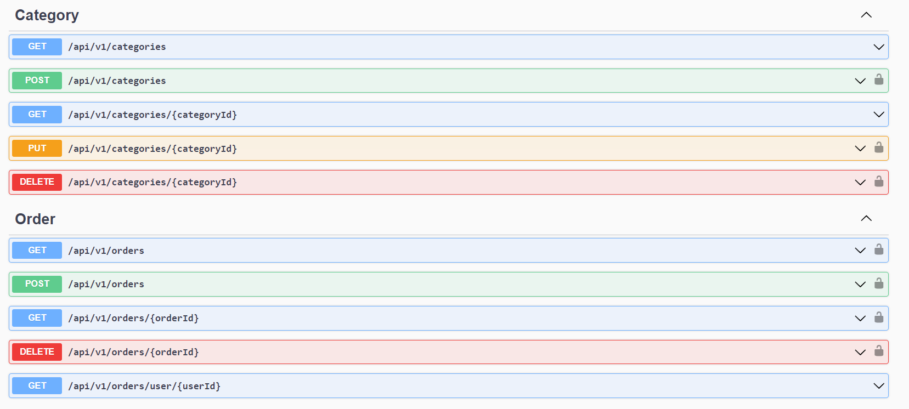
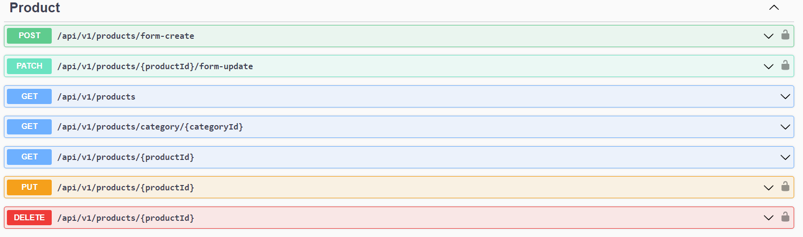
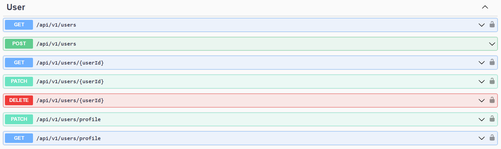

## Scripts

- `npm start`: Start the development server.
- `npm build`: Build the production-ready application.
- `npm test`: Run unit tests.
- `npm eject`: Eject from create-react-app configuration.

## Deployment

The application is deployed on Netlify. Click the button below to visit the live site:
[](https://ecommerce-fashion-adn.netlify.app/)

## License

This project is licensed under the [MIT License](LICENSE).